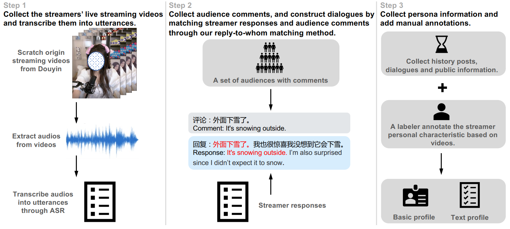

# LiveChat: A Large-Scale Personalized Dialogue Dataset Automatically Constructed from Live Streaming
This is the official repository for the ACL 2023 paper "LiveChat: A Large-Scale Personalized Dialogue Dataset Automatically Constructed from Live Streaming"


LiveChat is a large-scale dataset, composed of 1.33 million real-life Chinese dialogues with almost 3800 average sessions across 351 personas and fine-grained profiles for each persona. LiveChat is automatically constructed by processing numerous live videos on the Internet and naturally falls within the scope of multi-party conversations.

This repo implements two benchmark tasks (Response Modeling and Addressee Recognition) and a generation task (Generation) for LiveChat:

- Response Modeling (Retrival-based)
- Addressee Recognition 
- Generation (BART)

Instructions of how to run these models on the two tasks are described in their README files. Before trying them, you need to first download the dataset and unzip it into the folder ./Dataset. The file tree should be like

```
.
+-- dataset
|   +-- train.json
|   +-- val.json
|   +-- test.json
|   +-- basic_profile.json
|   +-- text_profile.json
```
## Data Download
We will public all our data soon!

## Citation
