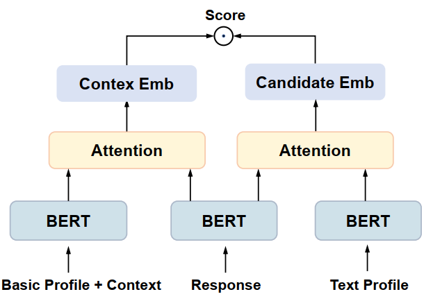

## How to run

Preprocessing the original data, and copy the data_path into --datadir

The file tree of datadir should be like:

```
.
+-- dataset
|   +-- train_data.pk
|   +-- test_data.pk
|   +-- dev_data.pk
```

## Train

Train CoBERT



```bash
python train_cobert.py --history_post --add_id --do_train --do_eval --apply_interaction --output_dir ./outputs --writer_dir ./outputs/runs
```

Train TwinBERT

```bash
python train_cobert.py --add_id --do_train --do_eval --apply_interaction --output_dir ./outputs --writer_dir ./outputs/runs
```

Train BERT

```shell
python train_bert.py  --add_id --do_train --do_eval --output_dir ./outputs --writer_dir ./outputs/runs
```

## Test

Test CoBERT or TwinBERT

```bash
python train_cobert.py --history_post --add_id --do_eval --apply_interaction --output_dir ./outputs --writer_dir ./outputs/runs --load_model_path outputs/epoch_i 
```

Test BERT

```bash
python train_bert.py --add_id --do_eval --apply_interaction --output_dir ./outputs --writer_dir ./outputs/runs --load_model_path outputs/epoch_i 
```

## 

